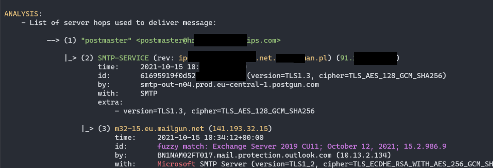
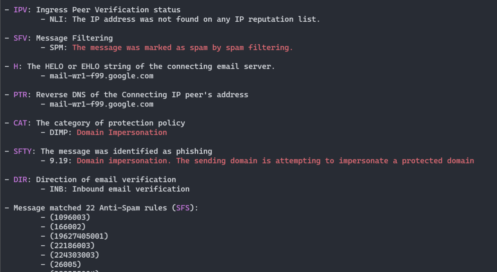
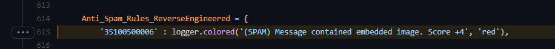

## `decode-spam-headers.py`

This tool accepts on input an `*.EML` or `*.txt` file with all the SMTP headers. It will then extract a subset of interesting headers and using **79+** tests will attempt to decode them as much as possible.

This script also extracts all IPv4 addresses and domain names and performs full DNS resolution of them.

Resulting output will contain useful information on why this e-mail might have been blocked.


### Example screenshots

- Chain of MTA servers (nicely parsed `Received` headers):



- Various headers decoded as much as possible, according to publicly available documentation (here _Office365 ForeFront Spam Report_):



- Different custom heuristics implement to actively validate and seek for clues of spam categorization, here logic detecting _Domain Impersonation_:


- Script attempts to reverse-engineer and document some of the Office365 Anti-Spam rules, as well as collect public knowledge about other opaque Anti-Spam headers:




### Processed headers

Processed headers (more than **67+** headers are parsed):

- `X-forefront-antispam-report`
- `X-exchange-antispam`
- `X-exchange-antispam-mailbox-delivery`
- `X-exchange-antispam-message-info`
- `X-microsoft-antispam-report-cfa-test`
- `Received`
- `From`
- `To`
- `Subject`
- `Thread-topic`
- `Received-spf`
- `X-mailer`
- `X-originating-ip`
- `User-agent`
- `X-forefront-antispam-report`
- `X-microsoft-antispam-mailbox-delivery`
- `X-microsoft-antispam`
- `X-exchange-antispam-report-cfa-test`
- `X-spam-status`
- `X-spam-level`
- `X-spam-flag`
- `X-spam-report`
- `X-vr-spamcause`
- `X-ovh-spam-reason`
- `X-vr-spamscore`
- `X-virus-scanned`
- `X-spam-checker-version`
- `X-ironport-av`
- `X-ironport-anti-spam-filtered`
- `X-ironport-anti-spam-result`
- `X-mimecast-spam-score`
- `Spamdiagnosticmetadata`
- `X-ms-exchange-atpmessageproperties`
- `X-msfbl`
- `X-ms-exchange-transport-endtoendlatency`
- `X-ms-oob-tlc-oobclassifiers`
- `X-ip-spam-verdict`
- `X-amp-result`
- `X-ironport-remoteip`
- `X-ironport-reputation`
- `X-sbrs`
- `X-ironport-sendergroup`
- `X-policy`
- `X-ironport-mailflowpolicy`
- `X-remote-ip`
- `X-sea-spam`
- `X-fireeye`
- `X-antiabuse`
- `X-tmase-version`
- `X-tm-as-product-ver`
- `X-tm-as-result`
- `X-imss-scan-details`
- `X-tm-as-user-approved-sender`
- `X-tm-as-user-blocked-sender`
- `X-tmase-result`
- `X-tmase-snap-result`
- `X-imss-dkim-white-list`
- `X-tm-as-result-xfilter`
- `X-tm-as-smtp`
- `X-scanned-by`
- `X-mimecast-spam-signature`
- `X-mimecast-bulk-signature`
- `X-sender-ip`
- `X-forefront-antispam-report-untrusted`
- `X-microsoft-antispam-untrusted`
- `X-sophos-senderhistory`
- `X-sophos-rescan`


Most of these headers are not fully documented, therefore the script is unable to pinpoint all the details, but at least it collects all I could find on them.

### Usage

Help:

```
PS> py .\decode-spam-headers.py --help
usage: decode-spam-headers.py [options] <file>

optional arguments:
  -h, --help            show this help message and exit

Required arguments:
  infile                Input file to be analysed or --list tests to show available tests.

Options:
  -o OUTFILE, --outfile OUTFILE
                        Output file with report
  -f {json,text}, --format {json,text}
                        Analysis report format. JSON, text. Default: text
  -N, --nocolor         Dont use colors in text output.
  -v, --verbose         Verbose mode.
  -d, --debug           Debug mode.
  -l, --list            List available tests and quit. Use it like so: --list tests

Tests:
  -i tests, --include-tests tests
                        Comma-separated list of test IDs to run. Ex. --include-tests 1,3,7
  -e tests, --exclude-tests tests
                        Comma-separated list of test IDs to skip. Ex. --exclude-tests 1,3,7
  -r, --resolve         Resolve IPv4 addresses / Domain names.
  -a, --decode-all      Decode all =?us-ascii?Q? mail encoded messages and print their contents.
```

If you want to run only a subset of tests, you'll first need to learn Test IDs of which to pick.
Run the script with `-l tests` to grab that list.

List available test and their corresponding IDs:

```
C:\> py decode-spam-headers.py -l tests

[.] Available tests:

        TEST_ID - TEST_NAME
        --------------------------------------
              1 - Received - Mail Servers Flow
              2 - Extracted IP addresses
              3 - Extracted Domains
              4 - Bad Keywords In Headers
              5 - From Address Analysis
              6 - Subject and Thread Topic Difference
              7 - Authentication-Results
              8 - ARC-Authentication-Results
              9 - Received-SPF
             10 - Mail Client Version
             11 - User-Agent Version
             12 - X-Forefront-Antispam-Report
             13 - X-MS-Exchange-Organization-SCL
             14 - X-Microsoft-Antispam-Mailbox-Delivery
             15 - X-Microsoft-Antispam Bulk Mail
             16 - X-Exchange-Antispam-Report-CFA-Test
             17 - Domain Impersonation
             18 - SpamAssassin Spam Status
             19 - SpamAssassin Spam Level
             20 - SpamAssassin Spam Flag
             21 - SpamAssassin Spam Report
             22 - OVH's X-VR-SPAMCAUSE
             23 - OVH's X-Ovh-Spam-Reason
             24 - OVH's X-Ovh-Spam-Score
             25 - X-Virus-Scan
             26 - X-Spam-Checker-Version
             27 - X-IronPort-AV
             28 - X-IronPort-Anti-Spam-Filtered
             29 - X-IronPort-Anti-Spam-Result
             30 - X-Mimecast-Spam-Score
             31 - Spam Diagnostics Metadata
             32 - MS Defender ATP Message Properties
             33 - Message Feedback Loop
             34 - End-to-End Latency - Message Delivery Time
             35 - X-MS-Oob-TLC-OOBClassifiers
             36 - X-IP-Spam-Verdict
             37 - X-Amp-Result
             38 - X-IronPort-RemoteIP
             39 - X-IronPort-Reputation
             40 - X-SBRS
             41 - X-IronPort-SenderGroup
             42 - X-Policy
             43 - X-IronPort-MailFlowPolicy
             44 - X-SEA-Spam
             45 - X-FireEye
             46 - X-AntiAbuse
             47 - X-TMASE-Version
             48 - X-TM-AS-Product-Ver
             49 - X-TM-AS-Result
             50 - X-IMSS-Scan-Details
             51 - X-TM-AS-User-Approved-Sender
             52 - X-TM-AS-User-Blocked-Sender
             53 - X-TMASE-Result
             54 - X-TMASE-SNAP-Result
             55 - X-IMSS-DKIM-White-List
             56 - X-TM-AS-Result-Xfilter
             57 - X-TM-AS-SMTP
             58 - X-TMASE-SNAP-Result
             59 - X-TM-Authentication-Results
             60 - X-Scanned-By
             61 - X-Mimecast-Spam-Signature
             62 - X-Mimecast-Bulk-Signature
             63 - X-Forefront-Antispam-Report-Untrusted
             64 - X-Microsoft-Antispam-Untrusted
             65 - X-Mimecast-Impersonation-Protect
             66 - X-Proofpoint-Spam-Details
             67 - X-Proofpoint-Virus-Version
             68 - SPFCheck
             69 - X-Barracuda-Spam-Score
             70 - X-Barracuda-Spam-Status
             71 - X-Barracuda-Spam-Report
             72 - X-Barracuda-Bayes
             73 - X-Barracuda-Start-Time
             74 - Similar to SpamAssassin Spam Level headers
             75 - SMTP Header Contained IP address
             76 - Other unrecognized Spam Related Headers
             77 - Other interesting headers
             78 - Security Appliances Spotted
             79 - Email Providers Infrastructure Clues
             80 - X-Microsoft-Antispam-Message-Info
             81 - Decoded Mail-encoded header values
             82 - Header Containing Client IP
```


### Sample run

Sample run:

```
  PS> py decode-spam-headers.py headers.txt

------------------------------------------
(1) Test: Received - Mail Servers Flow

HEADER:
    Received

VALUE:
    ...

ANALYSIS:
    - List of server hops used to deliver message:

          --> (1) "attacker" <attacker@attacker.com>

               |_> (2) SMTP-SERVICE (44.55.66.77)
                      time: 01 Jan 2021 12:34:20

                  |_> (3) mail-wr1-f51.google.com (209.85.221.51)
                          time: 01 Jan 2021 12:34:20
                          version: fuzzy match: Exchange Server 2019 CU11; October 12, 2021; 15.2.986.9

                      |_> (4) SN1NAM02FT0061.eop-nam02.prod.protection.outlook.com (2603:10b6:806:131:cafe::e5)
                              time: 01 Jan 2021 12:34:20
                              version: fuzzy match: Exchange Server 2019 CU11; October 12, 2021; 15.2.986.9

                          |_> (5) SA0PR11CA0138.namprd11.prod.outlook.com (2603:10b6:806:131::23)
                                  time: 01 Jan 2021 12:34:20
                                  version: fuzzy match: Exchange Server 2019 CU11; October 12, 2021; 15.2.986.9

                              |_> (6) CP2PR80MB4114.lamprd80.prod.outlook.com (2603:10d6:102:3c::15)
                                      time: 01 Jan 2021 12:34:23

                                  |_> (7) "Victim Surname" <victim@contoso.com>


------------------------------------------

[...]

------------------------------------------
(4) Test: Mail Client Version

HEADER:
    X-Mailer

VALUE:
    OEM

ANALYSIS:
    - X-Mailer header was present and contained value: "OEM".


------------------------------------------
(5) Test: X-Forefront-Antispam-Report

HEADER:
    X-Forefront-Antispam-Report

VALUE:
    CIP:209.85.167.100;CTRY:US;LANG:de;SCL:5;SRV:;IPV:NLI;SFV:SPM;H:mail-lf1-f100.google.com;PTR:mail-l
    f1-f100.google.com;CAT:DIMP;SFTY:9.19;SFS:(4636009)(956004)(166002)(6916009)(356005)(336012)(19
    625305002)(22186003)(5660300002)(4744005)(6666004)(35100500006)(82960400001)(26005)(7596003)(7636003)(554460
    02)(224303003)(1096003)(58800400005)(86362001)(9686003)(43540500002);DIR:INB;SFTY:9.19;

ANALYSIS:
    - Microsoft Office365/Exchange ForeFront Anti-Spam report

        - CIP: Connecting IP address: 209.85.167.100

        - CTRY: The source country as determined by the connecting IP address
                - US

        - LANG: The language in which the message was written
                - de

        - IPV: Ingress Peer Verification status
                - NLI: The IP address was not found on any IP reputation list.

        - SFV: Message Filtering
                - SPM: The message was marked as spam by spam filtering.

        - H: The HELO or EHLO string of the connecting email server.
                - mail-lf1-f100.google.com

        - PTR: Reverse DNS of the Connecting IP peer's address
                - mail-lf1-f100.google.com

        - CAT: The category of protection policy
                - DIMP: Domain Impersonation

        - SFTY: The message was identified as phishing
                - 9.19: Domain impersonation. The sending domain is attempting to impersonate a protected domain

        - DIR: Direction of email verification
                - INB: Inbound email verification

        - Message matched 24 Anti-Spam rules (SFS):
                - (1096003)
                - (166002)
                - (19625305002)
                - (22186003)
                - (224303003)
                - (26005)
                - (336012)
                - (356005)
                - (35100500006)         - (SPAM) Message contained embedded image.
                - (43540500002)
                - (4636009)
                - (4744005)
                - (55446002)
                - (5660300002)
                - (58800400005)
                - (6666004)
                - (6916009)
                - (7596003)
                - (7636003)
                - (82960400001)
                - (86362001)
                - (956004)
                - (9686003)

        - SCL: Spam Confidence Level: 5
                - SPAM: Spam filtering marked the message as Spam


More information:
        - https://docs.microsoft.com/en-us/microsoft-365/security/office-365-security/anti-spam-message-headers
        - https://docs.microsoft.com/en-us/exchange/antispam-and-antimalware/antispam-protection/antispam-stamps
        - https://docs.microsoft.com/en-us/microsoft-365/security/office-365-security/spam-confidence-levels
        - https://docs.microsoft.com/en-us/exchange/monitoring/trace-an-email-message/run-a-message-trace-and-view-results


------------------------------------------
(6) Test: X-Microsoft-Antispam-Mailbox-Delivery

HEADER:
    X-Microsoft-Antispam-Mailbox-Delivery

VALUE:
    ucf:0;jmr:1;auth:0;dest:J;ENG:(910001)(944506458)(944626604)(750132)(520011016);

ANALYSIS:
    - This header denotes what to do with received message, where to put it.

        - auth: Message originating from Authenticated sender
                - 0: Not Authenticated

        - dest: Destination where message should be placed
                - J: JUNK directory

        - Message matched 6 Anti-Spam Delivery rules:
                - (520011016)
                - (750132)
                - (910001)
                - (944506458)
                - (944626604)


------------------------------------------
(7) Test: X-Microsoft-Antispam Bulk Mail

HEADER:
    X-Microsoft-Antispam
VALUE:
    BCL:0;

ANALYSIS:
    - BCL: BULK Confidence Level: 0
        The message isn't from a bulk sender.

    More information:
                - https://docs.microsoft.com/en-us/microsoft-365/security/office-365-security/bulk-complaint-level-values

------------------------------------------

[...]

------------------------------------------
(10) Test: MS Defender ATP Message Properties

HEADER:
    X-MS-Exchange-AtpMessageProperties

VALUE:
    SA|SL

ANALYSIS:
    - MS Defender Advanced Threat Protection enabled following protections on this message:
        - Safe Attachments Protection
        - Safe Links Protection


------------------------------------------
(11) Test: Domain Impersonation

HEADER:
    From

VALUE:
    "attacker" <attacker@attacker.com>

ANALYSIS:
    - Mail From: <attacker@attacker.com>

                - Mail Domain: attacker.com
                       --> resolves to: 11.22.33.44
                           --> reverse-DNS resolves to: ec2-11-22-33-44.eu-west-3.compute.amazonaws.com
                               (sender's domain: amazonaws.com)

                - First Hop:   SMTP-SERVICE (44.55.66.77)
                       --> resolves to:
                           --> reverse-DNS resolves to: host44-55-66-77.static.arubacloud.pl
                               (first hop's domain: arubacloud.pl)

        - Domain SPF: "v=spf1 include:_spf.google.com ~all"

        - WARNING! Potential Domain Impersonation!
                - Mail's domain should resolve to:      amazonaws.com
                - But instead first hop resolved to:    arubacloud.pl
```
