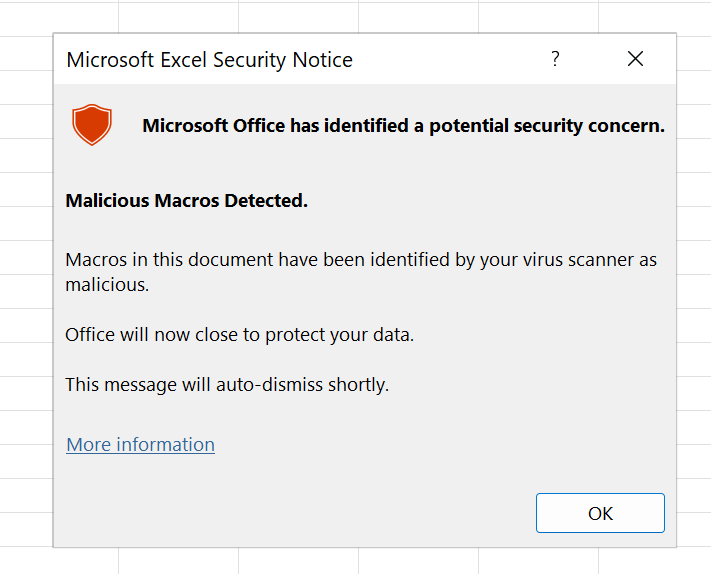

# Countering AMSI Detection

This page explains how to troubleshoot AMSI detections on Office documents. 
This is the typical error message indicating AMSI killed our maldoc:



The script provided in this directory, [again](https://github.com/mgeeky/Penetration-Testing-Tools/tree/master/red-teaming/Self-Signed%20Threat), uses splendid work of [Matt Graeber, @mattifestation](https://twitter.com/mattifestation), namely his [AMSITools.ps1]](https://gist.github.com/mgraeber-rc/1eb42d3ec9c2f677e70bb14c3b7b5c9c) script, that pulls AMSI events from Windows' event-log.


## Pulling AMSI Events

We can pull AMSI events to review more closely what happened thanks to Matt's [AMSITools.ps1]](https://gist.github.com/mgraeber-rc/1eb42d3ec9c2f677e70bb14c3b7b5c9c).

Follow these steps:

1. Disable your Anti-Virus. In Defender, that includes turning off Real-Time Detection option.

2. Open up Powershell as Administrator and browse to this script's directory.

3. Load up `Get-AMSIScanResult.ps1` script:

```
PS D:\AMSITools> . .\Get-AMSIScanResult.ps1
```

4. And then - to inspect Office document - simply launch the following:

```
PS D:\AMSITools> Get-AMSIScanResult -Interactive
```

5. You will be prompted with following message:

```
Trigger AMSI detections now and then press any key to pull AMSI events...
```

6. Now re-enable your Anti-Virus, to make sure AMSI provider will be active and Maldoc will get remediated.

7. Open up your faulty Maldoc document to ensure AMSI triggers and event gets generated

8. After seeing AMSI error dialog, close up Office application and get back to Powershell console.

9. Now hit **Enter** in the console and review output or follow instructions.


## Example Event

Example event look like following:

```
ProcessId       : 30828
ThreadId        : 14248
TimeCreated     : 02/09/2022 16:54:54
Session         : 0
ScanStatus      : 1
ScanResult      : AMSI_RESULT_DETECTED
AppName         : OFFICE_VBA
ContentName     : D:\rmf\output-files\evil2.xlsm
ContentSize     : 680
OriginalSize    : 680
Content         : IXMLDOMDocument2.createelement("obf_someInternalName");
                  IXMLDOMElement.nodetypedvalue();
                  IXMLDOMDocument2.createelement("obf_someInternalName");
                  IXMLDOMElement.nodetypedvalue();
                  IXMLDOMDocument2.createelement("obf_someInternalName");
                  IXMLDOMElement.nodetypedvalue();
                  IWshShell3.run("false", "0", "%WINDIR%\System32\conhost.exe "calc" """);

Hash            : 6C58AE0705D2CE87ED36E78E6C366118AA407776D898864F92FF5ADC50294268
ContentFiltered : False
```

The very last line of `Content` entry tells us, which was the last VBA line of code that generated AMSI event.


## Credits

**All credits go to Matt** - this directory contains HIS script, mirrored for preserverance purposes.
